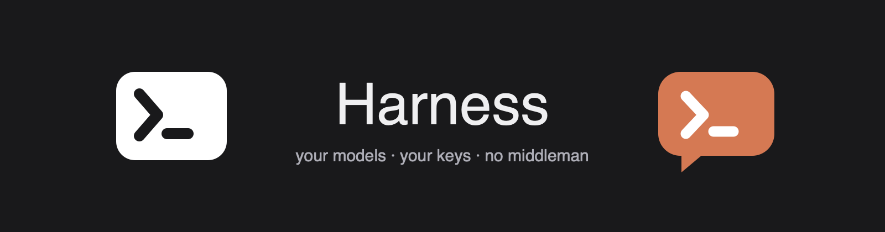
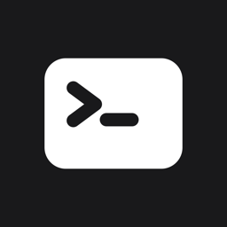
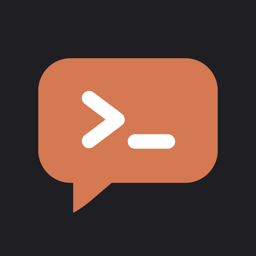
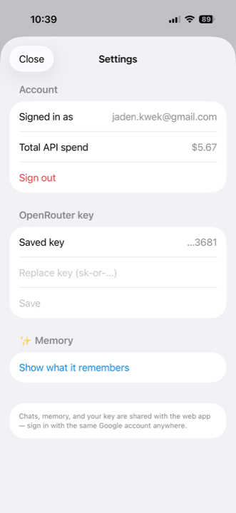
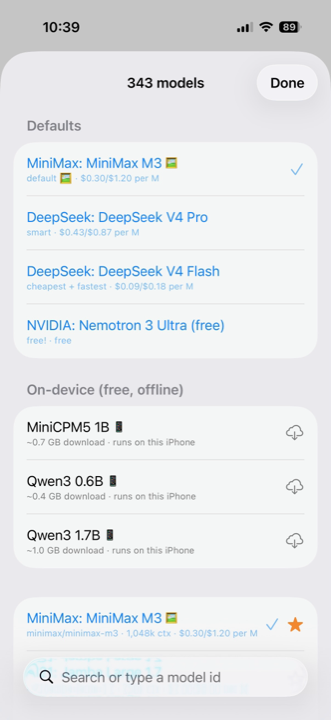
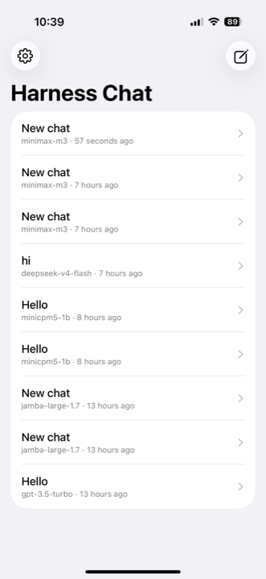
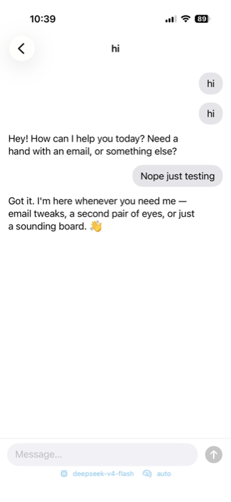

  

  
  
  

A small family of AI apps built on one idea: **your models, your keys, no middleman.** Everything runs on OpenRouter (340+ models at raw API prices), local models via Ollama or on-device MLX, with one shared design language — monochrome, terracotta ✳.

## The family

| | App | What it is |
|---|---|---|
|  | **[Harness Code](code/)** | A Claude Code / Codex-class desktop coding agent that runs on **any** model. Multi-session, sandboxed tools, git panels, browser + second-cursor computer use, MCP, local Ollama models, goal driver for chat-era models. Electron + a zero-dependency agent core. |
|  | **[Harness Code mobile](ios/)** | Your computer's coding agents — Claude Code, Codex, Harness Code — as a native iPhone app over your own Tailscale network. Approvals, diffs, push notifications, live shared sessions. (`ios/` + [`server/`](server/)) |
|  | **[Harness Chat — iOS](chat-ios/)** | ChatGPT-style chat for every OpenRouter model **plus on-device MLX models** that run in airplane mode. Tools (web search, real file downloads), automatic memory, synced with the web app — or use it with no account at all. |
|  | **[Harness Chat — web](chat-web/)** | The same chat as a PWA: Apple/Google sign-in (optional), BYOK, server-side history + memory, web search, and downloadable PDF/Excel/PowerPoint/HTML artifacts. Vercel + Supabase. [**Use it now →**](https://harness-chat-web.vercel.app) |
|  | **[Harness Chat — desktop](chat-desktop/)** | The web app as a native Mac + Windows app (ChatGPT-desktop style thin shell). [Download →](https://github.com/TheRealJadenKwek/harness/releases/latest) |
| | [`relay/`](relay/) | Push-notification relay for the mobile remote. |

## Harness Chat

  
  
  
  

Bring your own OpenRouter key and chat with anything — MiniMax, DeepSeek, Claude, GPT, Gemini, or the nostalgic dumb models you miss — at raw API prices. Web search and real file artifacts (PDF, XLSX, PPTX, HTML with live preview, zipped projects) on tool-capable models. Automatic memory that follows you between phone, web, and desktop. On-device MLX models for airplane mode. Accounts are optional; guest mode keeps everything on your device.

## Harness Code

  

The desktop coding agent, unbundled from any one model vendor: point it at anything on OpenRouter or anything in your local Ollama, and it plans, edits, runs, and verifies with sandboxed tools — plus the toys the commercial agents have (and some they don't: a second AI cursor for computer use, an iPhone bridge, a goal driver that makes even chat-era models finish multi-step work).

## Repo notes

Each directory was previously its own repository; histories were preserved via subtree merges and the old repos are archived. One repo, one design language, five surfaces.

MIT — see [LICENSE](LICENSE).
