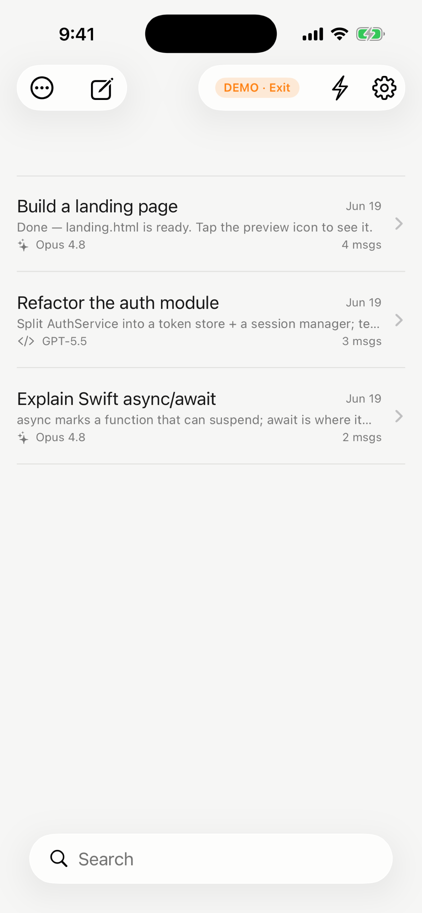
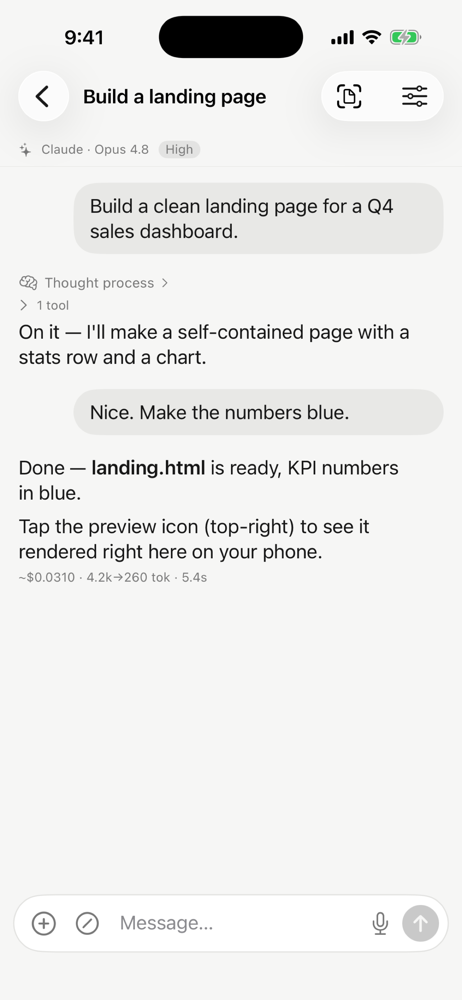
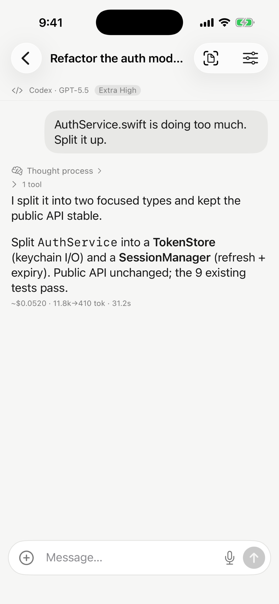
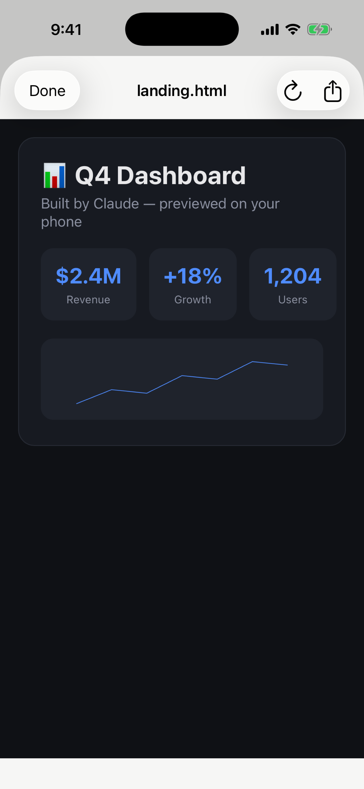

# Harness

**Your Mac's AI coding CLIs, as a native iPhone app.**

Harness turns Claude Code and Codex running on your own Mac or Windows PC into a phone-first experience: start threads, watch replies stream with full markdown, read reasoning summaries, review the diffs and files your agents produce, answer their questions with a tap, and get a push notification when a long task finishes — from anywhere, over your own private [Tailscale](https://tailscale.com) network.

Your computer does the work; your phone is the remote. No accounts, no middleman, no data leaves your devices.

| Threads | Chat | Reasoning & cost | Live preview |
|---|---|---|---|
|  |  |  |  |

## How it works

```
iPhone (SwiftUI app)  ──Tailscale──▶  harness server on your Mac/PC (stdlib Python, :8787)
                                        ├─▶ claude -p … --resume   (Claude Code)
                                        └─▶ codex exec --json …    (Codex)
```

- The server is a single-file, dependency-free Python HTTP+SSE server that fronts the CLIs you already have installed and logged in. Each thread is an independent, resumable CLI session.
- Transport is your own tailnet. The server binds locally and only accepts connections from loopback and the Tailscale CGNAT range, plus a bearer token generated at install.
- Turns run as detached jobs on the Mac — close the app mid-task and (optionally) get an APNs push when the answer is ready.

## Quick start

**1. Server** — Mac *or* Windows (requires Python 3, Tailscale, and at least one of the `claude` / `codex` CLIs):

macOS:

```sh
mkdir -p ~/harness-server && cd ~/harness-server
curl -fsSLO https://harness-site.vercel.app/server.py
curl -fsSLO https://harness-site.vercel.app/install.sh
bash install.sh
```

Windows (PowerShell):

```powershell
mkdir $env:USERPROFILE\harness-server; cd $env:USERPROFILE\harness-server
curl.exe -fsSLO https://harness-site.vercel.app/server.py
curl.exe -fsSLO https://harness-site.vercel.app/install.ps1
powershell -ExecutionPolicy Bypass -File install.ps1
```

Either installer generates your private token, sets the server to start at login and restart on crash (LaunchAgent on macOS, Task Scheduler on Windows), opens the firewall where needed, and prints the URL + token for the app. `uninstall.sh` / removing the `HarnessServer` scheduled task reverses it.

**2. iPhone app**: App Store (pending review) — or build from source:

```sh
brew install xcodegen
cd ios && xcodegen generate
open ClaudeHarness.xcodeproj   # set your team, build to your phone
```

No Mac handy? The app ships with a fully offline **demo mode** ("Explore the demo" on the welcome screen).

## Features

- Multiple concurrent threads, each with its own engine, model, working directory, permission mode, and reasoning effort
- Streaming replies with markdown, code blocks, collapsible thought-process disclosures, and tool-activity timelines (with red/green diffs for edits)
- Per-message token/cost readouts and usage-limit tracking
- Preview HTML, PDFs, images, and code your agents create — rendered on the phone, scoped and sandboxed on the Mac
- Tappable multiple-choice answers when Claude asks structured questions
- Voice dictation (on-device), image attachments, slash-command palette
- Archive, trash with 30-day recovery, search, drafts, deep-linked push notifications
- Server-driven model catalog: add any new model id to `providers.json` and it appears in the app's picker — no rebuild
- Bring-your-own-key providers (any Anthropic- or OpenAI-compatible endpoint) via `providers.json`

## Security model

- The server never listens beyond your machine + tailnet, and every request (except `/health`) requires the bearer token.
- File preview is path-scoped to each thread's working directory with a denylist for keys, dotfiles, and credentials; HTML previews get a no-network CSP.
- The app stores your server URL and token locally on-device only.
- No analytics, no telemetry, no third-party services. [Privacy policy](https://harness-site.vercel.app/privacy).

## License

MIT — see [LICENSE](LICENSE).

Harness is an independent project, not affiliated with Anthropic or OpenAI. Claude Code and Codex run under your own subscriptions.
