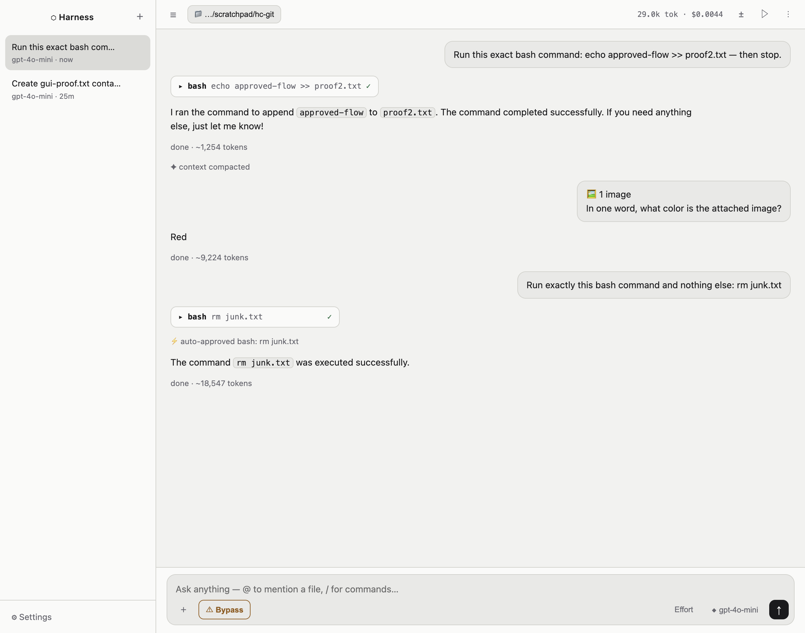
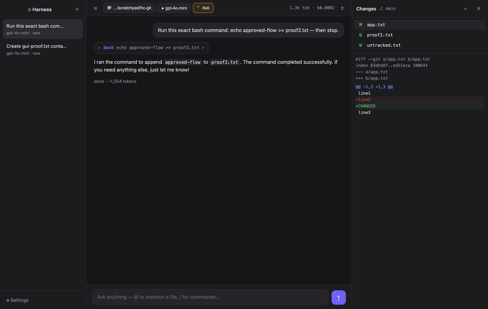
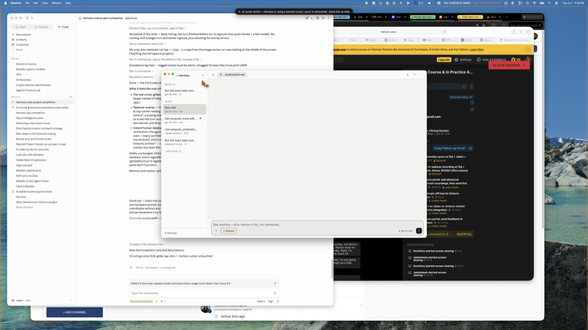

<div align="center">

# ⬡ Harness Code

**A Claude Code / Codex–class coding agent for your desktop — that runs on _any_ model.**

One OpenRouter key unlocks 340+ models — frontier, open-source, or gloriously obsolete — inside a full agentic environment: multi-session chats, sandboxed tools, git panels, computer use with its own cursor, an iPhone bridge, and zero runtime dependencies.

[](LICENSE)




</div>

---

## Why this exists

Claude Code and Codex are phenomenal — and locked to their vendors' models. Harness Code is the same class of tool, built from scratch, **model-agnostic by design**: run GLM-5 in the morning, Fable 5 for the hard parts, DeepSeek for volume, and GPT-3.5 for nostalgia — same tools, same panels, same permission system. Models without native tool-calling get an automatic ReAct text protocol, so even pre-2024 models can drive the full agent loop.

The agent core is pure Node with **zero dependencies** — no LangChain, no SDK, ~1,500 lines you can actually read.

## What it does

**The agent loop** — read / list / glob / grep / write / edit / bash / applescript tools, streamed tool-call assembly, live plan checklist the model ticks off, self-verification discipline baked into the prompt, sub-agent delegation, mid-turn steering (your message injects into the *running* turn).

**Safety you can feel** — five permission modes (Plan → Manual → Accept-edits → Auto → Bypass) with a destructive-action guard that interrupts even trusted models, "always allow" rules per project, macOS Seatbelt sandboxing (writes confined to the project), per-turn **checkpoints with one-click revert**, deleted-chat trash, and pre/post tool hooks that can veto any call.

**A real workspace** — git Changes panel with per-file discard + commit/PR buttons, worktree-per-session for parallel tasks, Files panel, background task runner with **live dev-server preview**, project memory via `HARNESS.md`, `/compact` plus automatic context management that keeps even 16k-context models alive on long sessions.

<div align="center"></div>

**Computer & browser use** — the agent drives a visible browser (you watch it click), and for desktop control it gets its **own orange "AI" cursor** that glides across a takeover overlay while *your* cursor stays yours. Screenshots reach vision models with coordinate scaling handled; Esc hands control back instantly.

<div align="center"></div>

**Extensible** — MCP connectors (stdio *and* remote Streamable-HTTP), markdown skills invoked as `/name`, installable plugins bundling both, and a token-gated local API.

**Phone-native** — pair with [Harness](https://github.com/TheRealJadenKwek/harness) (the iOS app) and every chat exists on both screens at once: message from your phone, watch it stream on your desktop, and vice versa.

**Daily-driver polish** — ghost-text suggested replies (Tab accepts), local whisper voice input (nothing leaves your Mac), vision image paste, model favourites, per-model reasoning-effort memory, spend tracking (day/week/month/YTD), model-written chat titles, cross-session search, one-click code copy, a live ✳ working indicator with elapsed time, and a read-only viewer that live-tails your Claude Code / Codex CLI sessions.

## vs. Claude Code / Codex desktop

| | Harness Code | Claude Code | Codex |
|---|---|---|---|
| Models | **Any of 340+ (OpenRouter)** | Claude only | OpenAI only |
| Old / non-tool-calling models | ✅ auto ReAct fallback | — | — |
| Computer use | ✅ second cursor (yours stays free) | via API | ✅ takes your cursor |
| Phone companion | ✅ two-way live sync | ✅ | ✅ |
| Spend tracking | ✅ built-in + credits | plan-based | plan-based |
| Agent core you can read | ✅ ~1,500 LOC, 0 deps | closed | partially open |
| Checkpoints / revert | ✅ | ✅ | ✅ |
| MCP / plugins / skills / hooks | ✅ | ✅ | ✅ |

## Quickstart

```bash
git clone https://github.com/TheRealJadenKwek/harness && cd harness/code
cd harness-code
npm install
npm start
```

Paste your OpenRouter key in Settings. That's the whole setup.

Headless (no GUI):

```bash
node run-headless.js "deepseek/deepseek-v4-pro" ~/myproject "add tests for utils.py" --auto
```

## Architecture

```
src/
  agent/           pure-Node core — usable headless, zero deps
    provider.js    OpenRouter streaming + tool-call assembly
    tools.js       file/search/shell tools, Seatbelt sandbox, danger guard
    agent.js       the loop: plan → act → verify · context fitting · steering
    mcp.js         MCP client (stdio + Streamable HTTP)
    prompt.js      system prompt + HARNESS.md project memory
  main/            Electron main: sessions, persistence, git, tasks, remote API
  renderer/        the UI — vanilla JS, no framework
assets/hc-cursor   native Swift cursor helper (CGEvent) for computer use
```

Sessions persist to `~/Library/Application Support/harness-code/`. Keyboard-first: ⌘N new chat · ⌘K models · ⌘D changes · ⇧⌘F files · ⇧Tab cycle mode · Tab accept suggestion · Esc stop.

## License

MIT — build whatever you want with it.
